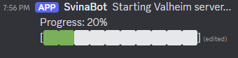
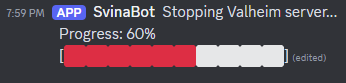
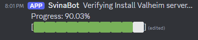
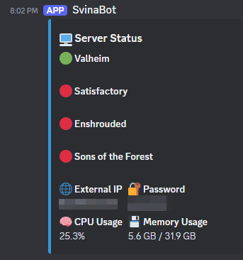

# Game Server Management Bot

This bot is something I put together to make managing my local Windows game server a lot easier, especially since my setup isn't exactly high-end. The main idea is to let me and my friends control game servers from our Discord server without needing to help them start/stop/update games.

## Why I Built This Bot

- **Limited Server Power**: My local server isn't powerful enough to run multiple game servers at once, so this bot makes sure that only one is running at a time, which helps prevent any crashes or overloads.

- **Dynamic IP Issues**: My ISP gives me a dynamic IP, which means it changes all the time. The bot makes it easy to share the current IP with my friends, so they can always connect without needing to ask me for it.

- **Remote Access**: Sometimes I’m not around, but my friends want to play. This bot lets them start, stop, or update game servers directly through Discord.


## Getting Started

### Prerequisites

- Python 3.8 or higher.

- Windows 10 or higher

- A Discord bot token. You can get one from the [Discord Developer Portal](https://discord.com/developers/applications).

- SteamCMD with some dedicated server games.


### Installation

1. **Clone the Repo**

```
git clone https://github.com/Jakob-Lindstrom/svinabot.git
cd svinabot
```

2. **Install Dependencies** Install everything you need using `pip`:

```
pip install -r requirements.txt
```

3. **Configure the Bot** Create your `config.yaml` based on the provided `config.example.yaml`. This is where you’ll add your server settings (folder strucutre).

4. Invite your bot to your Discord server

5. **Run the Bot**
```
python bot.py
```


### Configuration

The `config.yaml` file is where you configure your server settings. Just update it with your specifications or add additional games.

### Example for `config.yaml`. 

Example with Valheim, Satisfactory, Enshrouded and Sons of the forest. 
Enter startup_time on how long it takes for the server to start until it is Online
Enter shutdown_time on how long it takes for the server to shutdown.

```
# config.yaml


discord:
  token: 'Discord-Token'

password: 'PasswordThatYouSetOnYourGames'

games:
  valheim:
    start_command: "C:\\Users\\UserFolder\\svinabot\\scripts\\start_valheim.bat"
    update_command: "C:\\Users\\UserFolder\\SteamCMD\\update_valheim.bat"
    process_name: "valheim_server.exe"
    display_name: "Valheim"
    update_log: "C:\\Users\\UserFolder\\svinabot\\logs\\update_valheim.log"
    startup_time: 35
    shutdown_time: 5

  satisfactory:
    start_command: "C:\\Users\\UserFolder\\svinabot\\scripts\\start_satisfactory.bat"
    update_command: "C:\\Users\\UserFolder\\SteamCMD\\update_satisfactory.bat"
    process_name: "FactoryServer-Win64-Shipping-Cmd.exe"
    display_name: "Satisfactory"
    update_log: "C:\\Users\\UserFolder\\svinabot\\logs\\update_satisfactory.log"
    startup_time: 18
    shutdown_time: 5
    
  enshrouded:
    start_command: "C:\\Users\\UserFolder\\svinabot\\scripts\\start_enshrouded.bat"
    update_command: "C:\\Users\\UserFolder\\SteamCMD\\update_enshrouded.bat"
    process_name: "enshrouded_server.exe"
    display_name: "Enshrouded"
    update_log: "C:\\Users\\UserFolder\\svinabot\\logs\\update_enshrouded.log"
    startup_time: 5  
    shutdown_time: 5

  sons:
    start_command: "C:\\Users\\UserFolder\\svinabot\\scripts\\start_sons_of_the_forest.bat"
    update_command: "C:\\Users\\UserFolder\\SteamCMD\\update_sons_of_the_forest.bat"
    process_name: "SonsOfTheForestDS.exe"
    display_name: "Sons of the Forest"
    update_log: "C:\\Users\\UserFolder\\svinabot\\logs\\update_sons_of_the_forest.log"
    startup_time: 68 
    shutdown_time: 5

```
## Scripts

Edit start_game.bat to your folder structure.

Move and edit upload_game.bat to your SteamCMD folder.

## How to Use It

- **Start a Game Server**: `!start valheim`


    
- **Stop a Game Server**: `!stop valheim`


    
- **Restart a Game Server**: `!restart valheim`
    
- **Update a Game Server**: `!update valheim`
    
    

- **Get Server Status**: `!status`



- **Show commands**: `!help`
    

Right now, these are just basic text commands in Discord. In the future, I might add some additional features like slash commands or buttons to make it even easier.